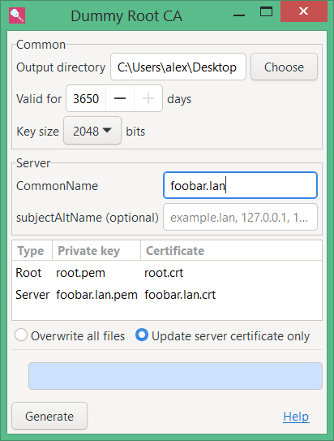

# dummy-root-ca

Generate a local root CA with server certificates for a development,
local-only web server.

## Linux

Run `dummy-root-ca.mk` (requires Make & openssl). If your hostname is
`foobar.lan`, it generates 4 files:

    root.pem root.crt foobar.lan.pem foobar.lan.crt

If you are in Fedora:

    # cp root.crt /etc/pki/ca-trust/source/anchors
    # update-ca-trust

then restart Chrome.

Test:

    $ ruby -run -e httpd . --ssl-private-key foobar.lan.pem --ssl-certificate foobar.lan.crt

## Windows

Download `dummy-root-ca-X.Y.Z.zip` from github *Releases* page,
unpack, run `bin/dummy-root-ca`.

To add a generated `root.crt`, click on in Explorer, then follow the
instructions for adding the cert:

* for the current user;
* into *Trusted Root Certification Authorities* (this is important);
  don't select the automatic detection option.

To check if the cert was added:

1. type `certmgr` in powershell;
2. select in menu *Action->Find Certificates...*, enter `dummy` as a
   search term.

Firefox uses its own cert store, but if you set
`security.enterprise_roots.enabled` in `about:config` to true, it'll
check the Windows cert store too.

## License

MIT.
